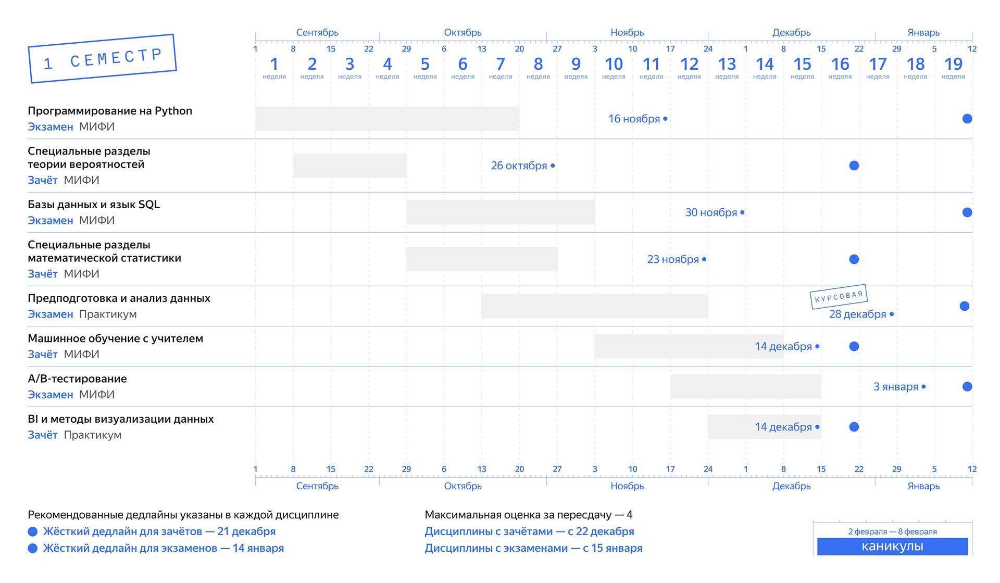

# Базовый курс

## Содержание
1. [Описание курса](#описание-курса)  
2. [Навигация по предметам](#навигация-по-предметам)  

---

### Описание курса
Курс предназначен для начинающих и охватывает ключевые технологии создания современных веб-приложений. Студенты освоят разработку на Python, различные аспекты анализа данных, работу с базами данных и систему контроля версий Git.

---

### Навигация по предметам
- [Программирование на Python](subjects/python.md)
- [Специальные разделы теории вероятностей](subjects/probability.md) 
 